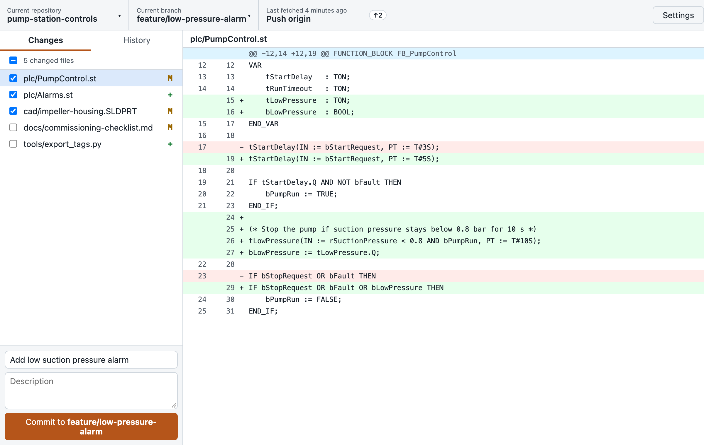
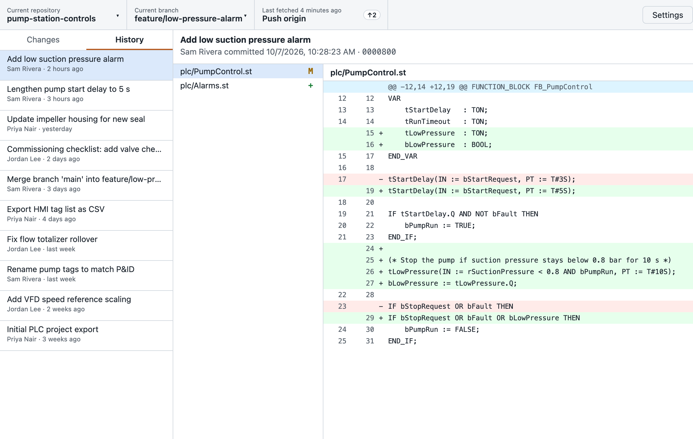
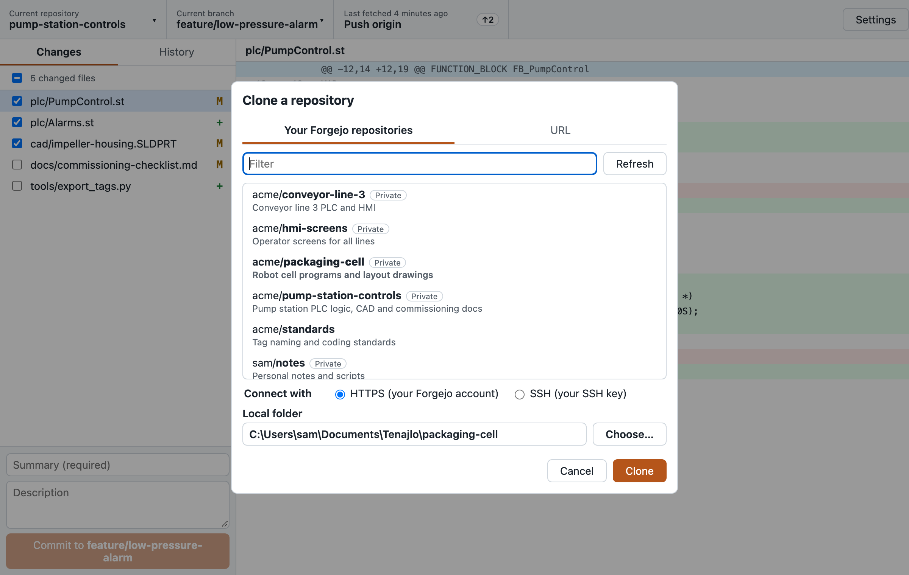
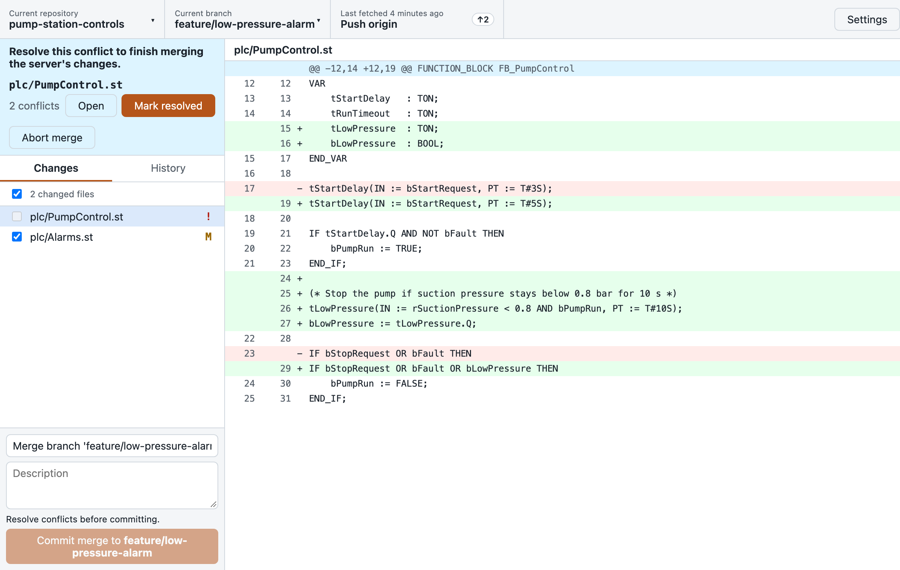

# Tenajlo

[](https://github.com/kovirlabs/tenajlo/actions/workflows/ci.yml)
[](LICENSE)
[](#build-from-source)

A desktop Git client for self-hosted [Forgejo](https://forgejo.org), in the spirit of GitHub
Desktop. It's made for engineers who work with code, PLC exports, CAD files and documentation
and would rather not learn the Git command line.

**Website:** <https://kovirlabs.github.io/tenajlo/>

> [!NOTE]
> Designed, reviewed, and maintained by me, [@evangress](https://github.com/evangress). I use AI coding tools heavily for implementation,
> but I own the architecture, read the changes, and use this app daily against my own Forgejo server.
> Bug reports go to a human.



- **Clone** your Forgejo repositories from a list, over HTTPS or SSH.
- **Commit, push, pull and branch** with one context-aware sync button.
- **Sign in once** with a Forgejo access token, kept in the OS password store. HTTPS remotes
  on that server then just work, and your existing Git credential helpers are left alone for
  other servers.
- **SSH** through your system's OpenSSH, with passphrase and host-key prompts shown in the
  app (never accepted automatically).
- **Large files** with Git LFS, bundled on Windows.
- **Conflicts** made approachable: merge the server's changes, open conflicted files, mark
  them resolved, or abort.
- **Works on company networks:** uses the OS certificate store (internal CAs), private DNS,
  and Windows long paths.

Windows 10/11 is the main platform; Linux and macOS work too.

| History                                                                                             | Clone                                                                           | Conflicts                                                                                         |
| --------------------------------------------------------------------------------------------------- | ------------------------------------------------------------------------------- | ------------------------------------------------------------------------------------------------- |
|  |  |  |

<sub>Screenshots show invented demo data; regenerate them with `node scripts/screenshots.mjs`.</sub>

## Documentation

- [User guide](docs/user-guide.md) (also [on the website](https://kovirlabs.github.io/tenajlo/guide/)):
  install, sign in, clone, commit, share, conflicts, troubleshooting
- [Releasing](docs/releasing.md): how installers are built and checked
- [Specification](spec.md): scope, architecture and security model

## Build from source

You need Rust (stable), Node.js 24 with pnpm, Git 2.40+ and Git LFS, plus
[Tauri's system dependencies](https://tauri.app/start/prerequisites/).

```bash
pnpm install
pnpm tauri dev      # run with hot reload
pnpm tauri build    # build an installer for this platform
```

Checks that CI runs:

```bash
pnpm typecheck && pnpm lint && pnpm test
cd src-tauri && cargo fmt --all -- --check && cargo clippy --all-targets -- -D warnings && cargo test --workspace
```

Integration tests run against Forgejo in Docker:

```bash
docker compose -f dev/forgejo.yml up -d && dev/seed-forgejo.sh
cd src-tauri && cargo test --features integration
```

## Contributing

Questions and ideas go to [Discussions](https://github.com/kovirlabs/tenajlo/discussions), bugs
to [Issues](https://github.com/kovirlabs/tenajlo/issues). See [CONTRIBUTING.md](CONTRIBUTING.md)
and the [Code of Conduct](CODE_OF_CONDUCT.md). Please report security problems privately
([SECURITY.md](SECURITY.md)).

## Privacy

Tenajlo has no telemetry or analytics. It only connects to the Git and Forgejo servers you
use.

## License

Apache License 2.0. See [LICENSE](LICENSE) and [NOTICE](NOTICE). Bundled third-party software
is listed in [THIRD_PARTY_NOTICES.md](THIRD_PARTY_NOTICES.md).

Tenajlo is an independent project by Kovir Labs. It is not affiliated with, endorsed by or
sponsored by GitHub, Inc. "GitHub" and "GitHub Desktop" are trademarks of GitHub, Inc.
